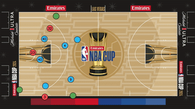

# NetBA: Computer Vision for Basketball game analysis

**NetBA** is a comprehensive computer vision system designed to digitize NBA broadcast footage. It transforms raw video into structured tactical data by detecting players, recognizing team affiliations and jersey numbers, and projecting movements onto a standardized 2D court view.

## 🎥 Demo





## 🚀 Key Features & Methodology

The project leverages state-of-the-art algorithms to achieve high-fidelity analysis:

* **Player Detection & Tracking**: Utilizes **YOLOv11** for detection and **ByteTrack** for robust multi-object tracking, handling occlusions and fast motion.
* **Team Classification**: Implements a lightweight **HSV Color Histogram + K-Means** clustering pipeline to distinguish teams in real-time, robust to white jersey variations.
* **Jersey Number Recognition**: Integrates **PaddleOCRv5** with a custom **Memory-Based Tracking Mechanism**. This solves the occlusion problem by linking recognized numbers to player IDs over time.
* **Homographic Court Transformation**: Generates a live "bird's eye view" (tactical board) by detecting 33 standardized court keypoints using **YOLOv8-Pose**.

## Installation

Before installing the project dependencies, make sure to install **PaddlePaddle**, which is required for OCR functionality.

1. **Install PaddlePaddle**

   Follow the official installation guide based on your system and environment:

   👉 [PaddlePaddle Installation Guide](https://www.paddlepaddle.org.cn/en/install/quick)

2. **Install project dependencies**

   After PaddlePaddle is installed, you can install the remaining dependencies:

   ```bash
   pip install -r requirements.txt
   ```

3. **Install and Initialize Git LFS**

   This project includes large model files (e.g., YOLO and PaddleOCR), which are managed using **Git LFS**.
   
   ```bash
   sudo apt install git-lfs
   git lfs install
   ```


## 🚀 Running the Project

To run the project, simply call `main.py` with the path to the input video as a command-line argument:

```bash
python main.py path/to/your/video.mp4
```

The `data/` directory already contains some example video files you can use for testing.

### 🎬 Output

The program produces two annotated videos:
- `players_detection.mp4`
- `radar.mp4`

These will be saved in the `output/` directory after processing.

## 👤 Authors
* **[Thomas Bertolani](https://github.com/ThomasBertolani)**
* **[Alessia Corni](https://github.com/alessiacorni)**
* **[Alessandro Paludetto](https://github.com/palu46)**